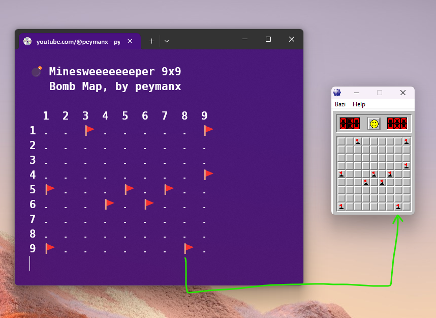

# Bomb map


```text
FLAG VALUE
1000 0000

BFCR
0001 0000   CLOSE
0001 0011   CLOSE [3]
0010 0000   OPEN  [0]
0010 0101   OPEN  [5]
0100 0000   FLAG
1100 0000   FLAG + BOMB
1000 1111   BOMB


```
## Download the game
[Go to download links](/executable)





```
        💣 Minesweeeeeeeper 9x9
        Bomb Map, by peymanx

        1  2  3  4  5  6  7  8  9
        1 .  .  🚩 .  .  .  .  .  🚩
        2 .  .  .  .  .  .  .  .  .
        3 .  .  .  .  .  .  .  .  .
        4 .  .  .  .  .  .  .  .  🚩
        5 🚩 .  .  .  🚩 .  🚩 .  .
        6 .  .  .  🚩 .  🚩 .  .  .
        7 .  .  .  .  .  .  .  .  .
        8 .  .  .  .  .  .  .  .  .
        9 🚩 .  .  .  .  .  .  🚩 .

```

### How to make noisy color banner
```bash
head -c 300000 /dev/random | convert -depth 8 -size 400x250 rgb:- -scale 10000x10000 noise.png


```
